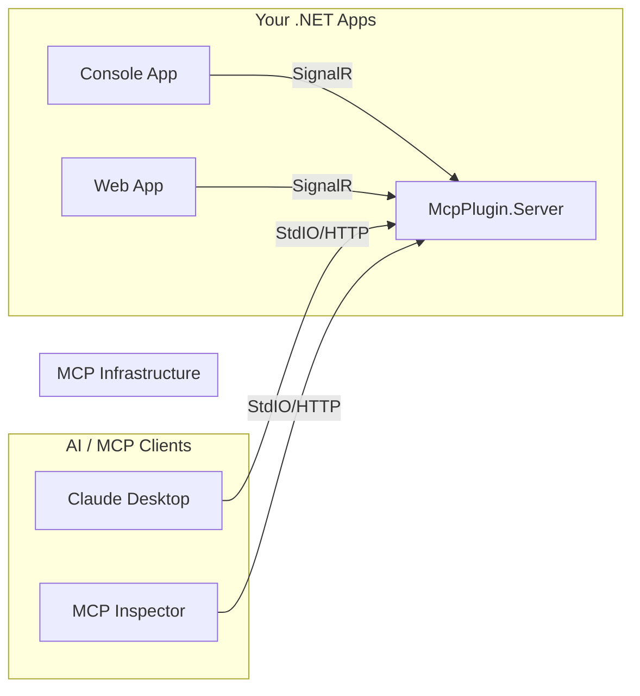

# MCP Plugin for .NET

[](https://www.nuget.org/packages/com.IvanMurzak.McpPlugin/)
[](https://github.com/IvanMurzak/MCP-Plugin-dotnet)
[](https://github.com/IvanMurzak/MCP-Plugin-dotnet/actions/workflows/release.yml)

[](https://github.com/IvanMurzak/MCP-Plugin-dotnet/stargazers)
[](https://discord.gg/Cgs6nM8BPU)
[](https://github.com/IvanMurzak/MCP-Plugin-dotnet/blob/main/LICENSE)
[](https://stand-with-ukraine.pp.ua)

## Overview

**MCP Plugin for .NET** is a comprehensive solution for integrating .NET applications with the [Model Context Protocol (MCP)](https://modelcontextprotocol.io/). It allows you to easily expose methods and data from your .NET applications as **Tools**, **Prompts**, and **Resources** to AI assistants (like Claude) and other MCP clients.

### The Problem: Independent Lifecycles

Standard MCP servers are typically designed to be launched as subprocesses by the client (e.g., Claude Desktop spawns a Python script). This works well for lightweight scripts but creates challenges for complex .NET applications like **Unity Engine**, **WPF Desktop Apps**, or **Game Servers**:

1. **Heavy Startup**: These applications are often too heavy to be spawned repeatedly by an MCP client.
2. **Independent Lifecycle**: They often need to run independently (e.g., you are already working in the Unity Editor).
3. **Live Context**: You want to interact with the *currently running* instance (e.g., "Add a cube to the current scene"), not start a new, empty instance.

### The Solution: The Bridge Pattern

This project solves this by decoupling the MCP Server from your application using a **Bridge Architecture**:

1. **McpPlugin (In-App)**: A library you add to your .NET application (e.g., Unity). It connects to the bridge.
2. **McpPlugin.Server (Bridge)**: A lightweight server that the MCP Client (Claude) launches. It acts as a gateway.

This enables **Bidirectional MCP Communication** with applications that have their own independent lifecycles.

## Architecture

The system uses a hub-and-spoke architecture where `McpPlugin.Server` acts as the central gateway.



## Features

- **Attribute-Based Registration**: Easily expose tools, prompts, and resources using `[McpPluginTool]`, `[McpPluginPrompt]`, and `[McpPluginResource]` attributes.
- **Automatic Schema Generation**: JSON schemas are automatically generated from method signatures.
- **Assembly Scanning**: Automatically discover and register components from assemblies.
- **Real-time Communication**: Uses SignalR for bidirectional communication between your apps and the MCP server.
- **Flexible Transport**: The server supports both `stdio` (for local AI agents) and `http` (for remote connections).
- **Dependency Injection**: First-class support for `Microsoft.Extensions.DependencyInjection`.

## Powered by ReflectorNet

This project is built on top of **[ReflectorNet](https://github.com/IvanMurzak/ReflectorNet)**, a sophisticated reflection toolkit designed for AI-driven environments. This enables:

- **🤖 AI-Ready Interaction**: Designed for scenarios where inputs from LLMs might be partial or fuzzy.
- **🔍 Fuzzy Matching**: Methods can be discovered and invoked even with incomplete names or parameters (configurable match levels).
- **📄 Automatic JSON Schemas**: Generates precise JSON schemas for your C# types and methods, allowing LLMs to understand your code structure perfectly.
- **📦 Type-Safe Serialization**: Preserves full type information, supporting complex nested objects and collections.

## Communication Protocol (SignalR)

A key feature of this architecture is the use of **SignalR** for the connection between your application (`McpPlugin`) and the bridge (`McpPlugin.Server`).

- **Single Port**: All communication happens over a single, explicitly configured HTTP port (default: `8080`). No complex firewall rules or multiple socket connections are required.
- **Bidirectional**: SignalR provides a persistent, real-time, bidirectional channel. The server can invoke tools on the client, and the client can send updates (like log messages or progress) to the server.
- **Resilient**: The plugin includes built-in automatic reconnection logic. If the server restarts, your application will automatically re-establish the link.

**Default Connection:**

- **Server**: Listens on `http://localhost:8080`
- **Hub Endpoint**: `/hub/mcp-server`
- **Client**: Connects to `http://localhost:8080/hub/mcp-server`

## Getting Started

### 1. The Server (`McpPlugin.Server`)

The server acts as a hub. You can run the provided `DemoWebApp` or host it in your own ASP.NET Core application.

**Running the Demo Server:**

```bash
cd DemoWebApp
dotnet run --port=11111 --client-transport=stdio
```

*Note: Use `--client-transport=stdio` if connecting from Claude Desktop, or `--client-transport=http` for HTTP-based clients.*

**Hosting in your own Web App:**

```csharp
// Program.cs
using com.IvanMurzak.McpPlugin.Common;
using com.IvanMurzak.McpPlugin.Server;

var builder = WebApplication.CreateBuilder(args);

// 1. Prepare arguments (or load from config)
var dataArguments = new DataArguments(args);

// 2. Register MCP Server services
builder.Services
    .WithMcpServer(dataArguments.ClientTransport) // TransportMethod.stdio or TransportMethod.http
    .WithMcpPluginServer(dataArguments);

var app = builder.Build();

// 3. Use MCP Server middleware
app.UseMcpPluginServer(dataArguments);

app.Run();
```

### 2. The Client App (`McpPlugin`)

Add the `com.IvanMurzak.McpPlugin` package to your .NET application.

**Defining Tools:**

```csharp
using com.IvanMurzak.McpPlugin;
using System.ComponentModel;

[McpPluginToolType]
public static class MyTools
{
    [McpPluginTool("calculate-sum", "Adds two numbers")]
    [Description("Adds two numbers")]
    public static int Add(int a, int b) => a + b;
}
```

**Connecting to the Server:**

```csharp
using com.IvanMurzak.McpPlugin;
using com.IvanMurzak.ReflectorNet;

// 1. Initialize Reflector (The core engine)
var reflector = new Reflector();

// 2. Configure and build the plugin
var plugin = new McpPluginBuilder()
    .WithConfigFromArgsOrEnv(args) // Loads config from args or environment variables
    // Option A: Scan assemblies for [McpPluginTool], [McpPluginPrompt], [McpPluginResource]
    .WithToolsFromAssembly(typeof(MyTools).Assembly)
    .WithPromptsFromAssembly(typeof(MyTools).Assembly)
    .WithResourcesFromAssembly(typeof(MyTools).Assembly)
    // Option B: Manually register specific types
    // .WithTools<MyTools>()
    // Option C: Manually register specific methods
    // .WithTool(typeof(MyTools).GetMethod("Add"))
    .Build(reflector); // Pass reflector instance

// 3. Connect to the MCP server
await plugin.Connect();
```

## Project Structure

- **`McpPlugin`**: The client library for .NET applications. Contains the core logic for managing tools, prompts, and resources.
- **`McpPlugin.Server`**: The server implementation that bridges SignalR clients to the MCP protocol.
- **`McpPlugin.Common`**: Shared data structures, interfaces, and protocol definitions.
- **`DemoConsoleApp`**: A sample client application demonstrating how to expose tools.
- **`DemoWebApp`**: A sample server application demonstrating how to host the MCP bridge.

## Configuration

The plugin uses `ConnectionConfig` for server connection settings. You can configure it via code or environment variables.

- **ServerUrl**: The URL of the MCP Server (e.g., `http://localhost:5000/mcp`).
- **TimeoutMs**: Operation timeout in milliseconds.
- **Retry Policy**: Automatic reconnection logic is built-in.

## License

This project is licensed under the Apache-2.0 License. Copyright - Ivan Murzak.
