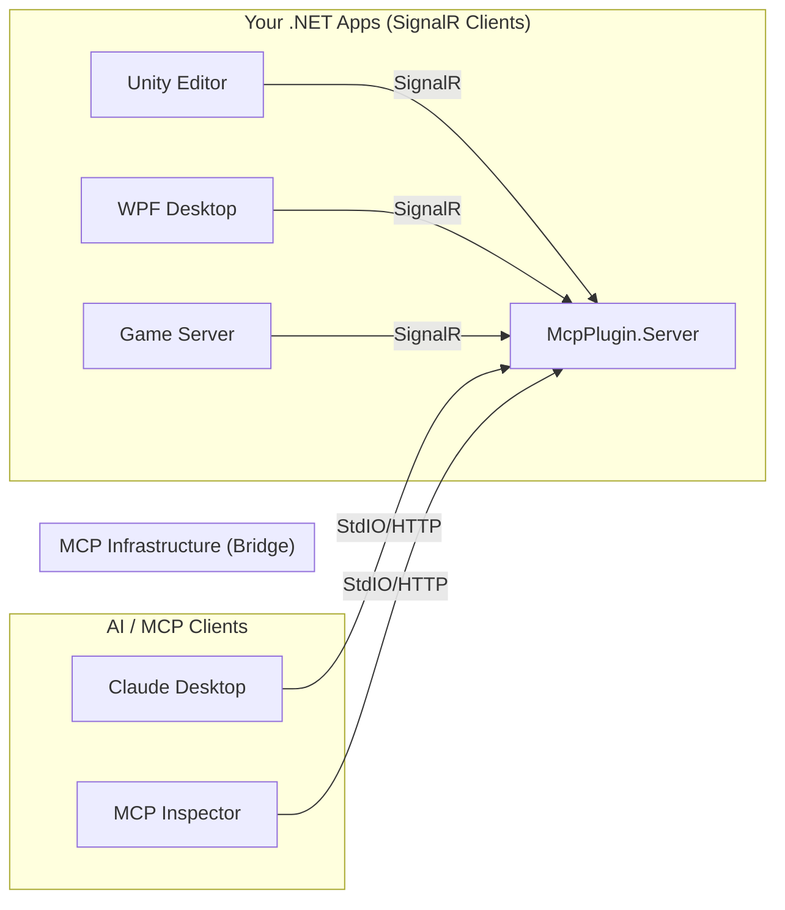

# MCP Plugin for .NET

[](https://www.nuget.org/packages/com.IvanMurzak.McpPlugin/)
[](https://github.com/IvanMurzak/MCP-Plugin-dotnet)
[](https://github.com/IvanMurzak/MCP-Plugin-dotnet/actions/workflows/release.yml)

[](https://github.com/IvanMurzak/MCP-Plugin-dotnet/stargazers)
[](https://discord.gg/Cgs6nM8BPU)
[](https://github.com/IvanMurzak/MCP-Plugin-dotnet/blob/main/LICENSE)
[](https://stand-with-ukraine.pp.ua)

## Overview

**MCP Plugin for .NET** is a comprehensive solution for integrating .NET applications with the [Model Context Protocol (MCP)](https://modelcontextprotocol.io/). It allows you to easily expose methods and data from your .NET applications as **Tools**, **Prompts**, and **Resources** to AI assistants (like Claude) and other MCP clients.

### The Problem: Independent Lifecycles

Standard MCP servers are typically designed to be launched as subprocesses by the client (e.g., Claude Desktop spawns a Python script). This works well for lightweight scripts but creates challenges for complex .NET applications like **Unity Engine**, **WPF Desktop Apps**, or **Game Servers**:

1. **Heavy Startup**: These applications are often too heavy to be spawned repeatedly by an MCP client.
2. **Independent Lifecycle**: They often need to run independently (e.g., you are already working in the Unity Editor).
3. **Live Context**: You want to interact with the *currently running* instance (e.g., "Add a cube to the current scene"), not start a new, empty instance.

### The Solution: The Bridge Pattern

This project solves this by decoupling the MCP Server from your application using a **Bridge Architecture**:

1. **McpPlugin (In-App)**: A lightweight library you add to your .NET application (e.g., Unity, WPF, Console). It connects to the bridge via **SignalR**.
2. **McpPlugin.Server (Bridge)**: A high-performance gateway that the MCP Client (Claude) launches. It acts as a persistent mediator.

**Why SignalR?**

- **Resilience**: Built-in automatic reconnection logic. If the bridge restarts, your app reconnects instantly.
- **Simplicity**: Operates over a single HTTP port (default `8080`). No complex firewall rules.
- **Bidirectional**: The bridge can invoke tools in your app, and your app can push updates (logs, progress) back to the bridge.

## Architecture

The system uses a hub-and-spoke architecture where `McpPlugin.Server` acts as the central gateway.



## Features

- **Attribute-Based Registration**: Easily expose tools, prompts, and resources using `[McpPluginTool]`, `[McpPluginPrompt]`, and `[McpPluginResource]` attributes.
- **Powered by ReflectorNet**:
  - **Complex Type Support**: Seamlessly handle nested objects, collections, and custom types in tool parameters.
  - **Fuzzy Matching**: AI can find and call methods even with partial names or slightly mismatched signatures.
  - **Automatic Schema Generation**: Precise JSON schemas are generated for your C# types to help LLMs understand your code perfectly.
- **Real-time Bidirectional Communication**: Uses SignalR for a persistent, low-latency link between your apps and the bridge.
- **Flexible Transport**: The bridge supports both `stdio` (for local AI agents like Claude Desktop) and `http` (for remote connections).
- **Dependency Injection**: First-class support for `Microsoft.Extensions.DependencyInjection`.
- **Assembly Scanning**: Automatically discover and register components from your entire project.

## Communication Protocol (SignalR)

A key feature of this architecture is the use of **SignalR** for the connection between your application (`McpPlugin`) and the bridge (`McpPlugin.Server`).

- **Single Port**: All communication happens over a single, explicitly configured HTTP port (default: `8080`). No complex firewall rules or multiple socket connections are required.
- **Bidirectional**: SignalR provides a persistent, real-time, bidirectional channel. The server can invoke tools on the client, and the client can send updates (like log messages or progress) to the server.
- **Resilient**: The plugin includes built-in automatic reconnection logic. If the server restarts, your application will automatically re-establish the link.

**Default Connection:**

- **Server**: Listens on `http://localhost:8080`
- **Hub Endpoint**: `/hub/mcp-server`
- **Client**: Connects to `http://localhost:8080/hub/mcp-server`

## Getting Started

### 1. The Server (`McpPlugin.Server`)

The server acts as a hub. You can run the provided `DemoWebApp` or host it in your own ASP.NET Core application.

**Running the Demo Server:**

```bash
cd DemoWebApp
dotnet run --port=11111 --client-transport=stdio
```

*Note: Use `--client-transport=stdio` if connecting from Claude Desktop, or `--client-transport=http` for HTTP-based clients.*

**Hosting in your own Web App:**

```csharp
// Program.cs
using com.IvanMurzak.McpPlugin.Common;
using com.IvanMurzak.McpPlugin.Common.Utils;
using com.IvanMurzak.McpPlugin.Server;

var builder = WebApplication.CreateBuilder(args);

// 1. Prepare arguments (or load from config)
var dataArguments = new DataArguments(args);

// 2. Register MCP Server services
builder.Services
    .WithMcpServer(dataArguments.ClientTransport) // TransportMethod.stdio or TransportMethod.http
    .WithMcpPluginServer(dataArguments);

var app = builder.Build();

// 3. Use MCP Server middleware
app.UseMcpPluginServer(dataArguments);

app.Run();
```

### 2. The Client App (`McpPlugin`)

Add the `com.IvanMurzak.McpPlugin` package to your .NET application.

**Defining Tools, Prompts, and Resources:**

```csharp
using com.IvanMurzak.McpPlugin;
using System.ComponentModel;

[McpPluginToolType]
public static class MyMcpComponents
{
    // --- Tools ---
    [McpPluginTool("calculate-sum", "Adds two numbers")]
    [Description("Adds two numbers")]
    public static int Add(int a, int b) => a + b;

    // --- Prompts ---
    [McpPluginPrompt("explain-code", "Explains a piece of code")]
    public static string ExplainCode(string code) => $"The following code: {code} does X, Y, and Z.";

    // --- Resources ---
    [McpPluginResource("system-logs", "Returns the latest system logs", "logs://system")]
    public static string GetLogs() => "Log entry 1: System started...";
}
```

**Connecting to the Server:**

```csharp
using com.IvanMurzak.McpPlugin;
using com.IvanMurzak.ReflectorNet;

// 1. Initialize Reflector (The core engine)
var reflector = new Reflector();

// 2. Configure and build the plugin
var plugin = new McpPluginBuilder()
    .WithConfig(config => {
        config.Host = "http://localhost:11111"; // Match your server port
    })
    // Option A: Scan assemblies for [McpPluginTool], [McpPluginPrompt], [McpPluginResource]
    .WithToolsFromAssembly(typeof(MyMcpComponents).Assembly)
    .WithPromptsFromAssembly(typeof(MyMcpComponents).Assembly)
    .WithResourcesFromAssembly(typeof(MyMcpComponents).Assembly)
    .Build(reflector);

// 3. Connect to the MCP server
await plugin.Connect();
```

## Advanced Features

### 🧩 Complex Type Support (via ReflectorNet)

Unlike standard MCP implementations that struggle with complex .NET types, this plugin handles them natively. You can pass nested objects or collections as tool parameters:

```csharp
public class UserProfile {
    public string Name { get; set; }
    public List<string> Roles { get; set; }
}

[McpPluginTool("update-user")]
public static void UpdateUser(UserProfile profile) {
    // ReflectorNet automatically deserializes the JSON from the AI into this object
}
```

### 🔍 Fuzzy Matching

You can configure how strictly the AI must match your method names. This is useful when LLMs use slightly different terminology:

```csharp
var plugin = new McpPluginBuilder()
    // ...
    .Build(reflector);

// Configure fuzzy matching level (1-6)
// 6: Exact, 3: StartsWith (Case-Insensitive), 1: Contains (Case-Insensitive)
plugin.MethodNameMatchLevel = 3;
```

## Configuration Reference

### Server (`McpPlugin.Server`)

| Argument / Env Var | Description | Default |
| :--- | :--- | :--- |
| `--port` / `MCP_SERVER_PORT` | The port the SignalR hub listens on. | `8080` |
| `--client-transport` / `MCP_CLIENT_TRANSPORT` | `stdio` or `http`. | `http` |
| `--plugin-timeout` / `MCP_PLUGIN_TIMEOUT` | Timeout for plugin operations (ms). | `30000` |

### Plugin (`McpPlugin`)

| Property | Description | Default |
| :--- | :--- | :--- |
| `Host` | The URL of the bridge server. | `http://localhost:8080` |
| `TimeoutMs` | Operation timeout. | `30000` |
| `KeepConnected` | Automatically reconnect if connection is lost. | `true` |

## Docker Support

You can run the bridge server in a Docker container:

```bash
docker build -t mcp-bridge -f McpPlugin.Server/Dockerfile .
docker run -p 8080:8080 mcp-bridge --port=8080 --client-transport=http
```

## Project Structure

- **`McpPlugin`**: The client library for .NET applications. Contains the core logic for managing tools, prompts, and resources.
- **`McpPlugin.Server`**: The server implementation that bridges SignalR clients to the MCP protocol.
- **`McpPlugin.Common`**: Shared data structures, interfaces, and protocol definitions.
- **`DemoConsoleApp`**: A sample client application demonstrating how to expose tools.
- **`DemoWebApp`**: A sample server application demonstrating how to host the MCP bridge.

## License

This project is licensed under the Apache-2.0 License. Copyright - Ivan Murzak.
