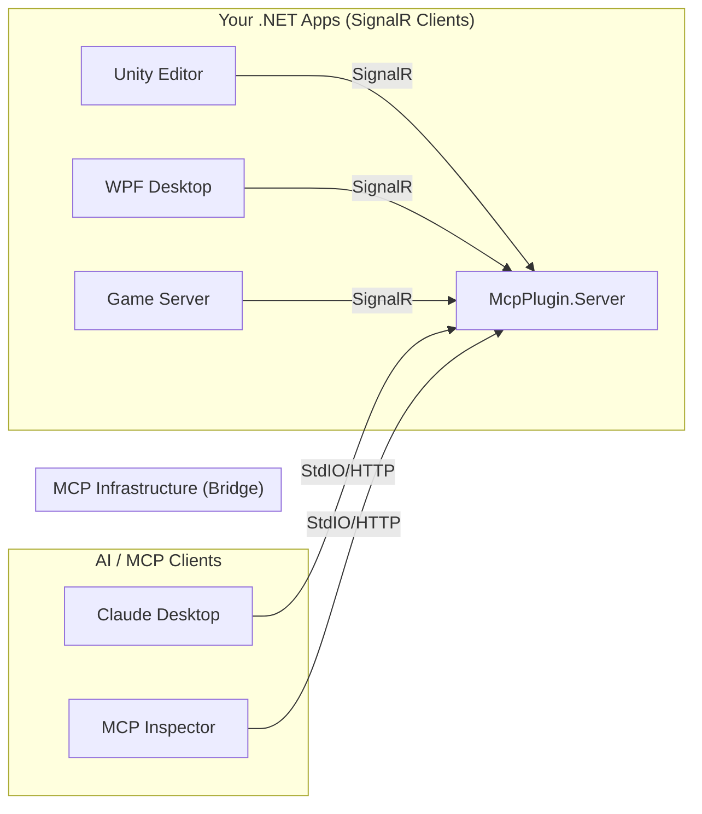

# MCP Plugin for .NET

[](https://www.nuget.org/packages/com.IvanMurzak.McpPlugin/)
[](https://github.com/IvanMurzak/MCP-Plugin-dotnet)
[](https://github.com/IvanMurzak/MCP-Plugin-dotnet/actions/workflows/release.yml)

[](https://github.com/IvanMurzak/MCP-Plugin-dotnet/stargazers)
[](https://discord.gg/Cgs6nM8BPU)
[](https://github.com/IvanMurzak/MCP-Plugin-dotnet/blob/main/LICENSE)
[](https://stand-with-ukraine.pp.ua)

## Overview

**MCP Plugin for .NET** is a comprehensive solution for integrating .NET applications with the [Model Context Protocol (MCP)](https://modelcontextprotocol.io/). It allows you to easily expose methods and data from your .NET applications as **Tools**, **Prompts**, and **Resources** to AI assistants (like Claude) and other MCP clients.

### The Problem: Independent Lifecycles

Standard MCP servers are typically designed to be launched as subprocesses by the client (e.g., Claude Desktop spawns a Python script). This works well for lightweight scripts but creates challenges for complex .NET applications like **Unity Engine**, **WPF Desktop Apps**, or **Game Servers**:

1. **Heavy Startup**: These applications are often too heavy to be spawned repeatedly by an MCP client.
2. **Independent Lifecycle**: They often need to run independently (e.g., you are already working in the Unity Editor).
3. **Live Context**: You want to interact with the *currently running* instance (e.g., "Add a cube to the current scene"), not start a new, empty instance.

### The Solution: The Bridge Pattern

This project solves this by decoupling the MCP Server from your application using a **Bridge Architecture**:

1. **McpPlugin (In-App)**: A lightweight library you add to your .NET application (e.g., Unity, WPF, Console). It connects to the bridge via **SignalR**.
2. **McpPlugin.Server (Bridge)**: A high-performance gateway that the MCP Client (Claude) launches. It acts as a persistent mediator.

**Why SignalR?**

- **Resilience**: Built-in automatic reconnection logic. If the bridge restarts, your app reconnects instantly.
- **Simplicity**: Operates over a single HTTP port (default `8080`). No complex firewall rules.
- **Bidirectional**: The bridge can invoke tools in your app, and your app can push updates (logs, progress) back to the bridge.

## Architecture

The system uses a hub-and-spoke architecture where `McpPlugin.Server` acts as the central gateway.


```mermaid
graph LR
    subgraph "Your .NET Apps (SignalR Clients)"
        A[Unity Editor] -- SignalR --> S
        B[WPF Desktop] -- SignalR --> S
        E[Game Server] -- SignalR --> S
    end

    subgraph "MCP Infrastructure (Bridge)"
        S[McpPlugin.Server]
    end

    subgraph "AI / MCP Clients"
        C[Claude Desktop] -- StdIO/HTTP --> S
        D[MCP Inspector] -- StdIO/HTTP --> S
    end
```

## Features

- **Attribute-Based Registration**: Easily expose tools, prompts, and resources using `[McpPluginTool]`, `[McpPluginPrompt]`, and `[McpPluginResource]` attributes.
- **Powered by ReflectorNet**:
  - **Complex Type Support**: Seamlessly handle nested objects, collections, and custom types in tool parameters.
  - **Fuzzy Matching**: AI can find and call methods even with partial names or slightly mismatched signatures.
  - **Automatic Schema Generation**: Precise JSON schemas are generated for your C# types to help LLMs understand your code perfectly.
- **Real-time Bidirectional Communication**: Uses SignalR for a persistent, low-latency link between your apps and the bridge.
- **Flexible Transport**: The bridge supports both `stdio` (for local AI agents like Claude Desktop) and `http` (for remote connections).
- **Dependency Injection**: First-class support for `Microsoft.Extensions.DependencyInjection`.
- **Assembly Scanning**: Automatically discover and register components from your entire project.

## Communication Protocol (SignalR)

A key feature of this architecture is the use of **SignalR** for the connection between your application (`McpPlugin`) and the bridge (`McpPlugin.Server`).

- **Single Port**: All communication happens over a single, explicitly configured HTTP port (default: `8080`). No complex firewall rules or multiple socket connections are required.
- **Bidirectional**: SignalR provides a persistent, real-time, bidirectional channel. The server can invoke tools on the client, and the client can send updates (like log messages or progress) to the server.
- **Resilient**: The plugin includes built-in automatic reconnection logic. If the server restarts, your application will automatically re-establish the link.

**Default Connection:**

- **Server**: Listens on `http://localhost:8080`
- **Hub Endpoint**: `/hub/mcp-server`
- **Client**: Connects to `http://localhost:8080/hub/mcp-server`

## Getting Started

### 1. The Server (`McpPlugin.Server`)

The server acts as a hub. You can run the provided `DemoWebApp` or host it in your own ASP.NET Core application.

**Running the Demo Server:**

```bash
cd DemoWebApp
dotnet run port=11111 client-transport=stdio
```

*Note: Use `client-transport=stdio` if connecting from Claude Desktop, or `client-transport=http` for HTTP-based clients.*

**Hosting in your own Web App:**

```csharp
// Program.cs
using com.IvanMurzak.McpPlugin.Common;
using com.IvanMurzak.McpPlugin.Common.Utils;
using com.IvanMurzak.McpPlugin.Server;

var builder = WebApplication.CreateBuilder(args);

// 1. Prepare arguments (or load from config)
var dataArguments = new DataArguments(args);

// 2. Register MCP Server services
builder.Services
    .WithMcpServer(dataArguments) // Configures transport based on dataArguments.ClientTransport
    .WithMcpPluginServer(dataArguments);

var app = builder.Build();

// 3. Use MCP Server middleware
app.UseMcpPluginServer(dataArguments);

app.Run();
```

### 2. The Client App (`McpPlugin`)

Add the `com.IvanMurzak.McpPlugin` package to your .NET application.

**Defining Tools, Prompts, and Resources:**

```csharp
using com.IvanMurzak.McpPlugin;
using System.ComponentModel;

[McpPluginToolType]
public static class MyMcpComponents
{
    // --- Tools ---
    [McpPluginTool("calculate-sum", "Adds two numbers")]
    [Description("Adds two numbers")]
    public static int Add(int a, int b) => a + b;

    // --- Prompts ---
    [McpPluginPrompt("explain-code", "Explains a piece of code")]
    public static string ExplainCode(string code) => $"The following code: {code} does X, Y, and Z.";

    // --- Resources ---
    [McpPluginResource("system-logs", "Returns the latest system logs", "logs://system")]
    public static string GetLogs() => "Log entry 1: System started...";
}
```

**Connecting to the Server:**

```csharp
using com.IvanMurzak.McpPlugin;
using com.IvanMurzak.ReflectorNet;

// 1. Initialize Reflector (The core engine)
var reflector = new Reflector();

// 2. Configure and build the plugin
var plugin = new McpPluginBuilder()
    .WithConfig(config => {
        config.Host = "http://localhost:11111"; // Match your server port
    })
    // Option A: Scan assemblies for [McpPluginTool], [McpPluginPrompt], [McpPluginResource]
    .WithToolsFromAssembly(typeof(MyMcpComponents).Assembly)
    .WithPromptsFromAssembly(typeof(MyMcpComponents).Assembly)
    .WithResourcesFromAssembly(typeof(MyMcpComponents).Assembly)
    .Build(reflector);

// 3. Connect to the MCP server
await plugin.Connect();
```

## Advanced Features

### 🧩 Complex Type Support (via ReflectorNet)

Unlike standard MCP implementations that struggle with complex .NET types, this plugin handles them natively. You can pass nested objects or collections as tool parameters:

```csharp
public class UserProfile {
    public string Name { get; set; }
    public List<string> Roles { get; set; }
}

[McpPluginTool("update-user")]
public static void UpdateUser(UserProfile profile) {
    // ReflectorNet automatically deserializes the JSON from the AI into this object
}
```

### 🔍 Fuzzy Matching

You can configure how strictly the AI must match your method names. This is useful when LLMs use slightly different terminology:

```csharp
var plugin = new McpPluginBuilder()
    // ...
    .Build(reflector);

// Configure fuzzy matching level (1-6)
// 6: Exact, 3: StartsWith (Case-Insensitive), 1: Contains (Case-Insensitive)
plugin.MethodNameMatchLevel = 3;
```

## Configuration Reference

### Server (`McpPlugin.Server`)

Command-line arguments take priority over environment variables.

| Argument | Env Var | Description | Default |
| :--- | :--- | :--- | :--- |
| `port` | `MCP_PLUGIN_PORT` | The port the SignalR hub listens on. | `8080` |
| `client-transport` | `MCP_PLUGIN_CLIENT_TRANSPORT` | Transport method: `stdio` or `streamableHttp`. | `streamableHttp` |
| `plugin-timeout` | `MCP_PLUGIN_CLIENT_TIMEOUT` | Timeout for plugin operations (ms). | `10000` |
| `token` | `MCP_PLUGIN_TOKEN` | Bearer token required from connecting plugins. | *(none)* |
| `authorization` | `MCP_AUTHORIZATION` | Authorization mode: `none` or `required`. | `none` |

#### Analytics Webhooks

`McpPlugin.Server` can emit fire-and-forget HTTP POST notifications to external endpoints for observability and analytics. Each event category has an independent URL, so you can route tool, prompt, resource, and connection events to different systems.

| Argument | Env Var | Description | Default |
| :--- | :--- | :--- | :--- |
| `webhook-tool-url` | `MCP_PLUGIN_WEBHOOK_TOOL_URL` | Endpoint to receive tool call events. | *(none)* |
| `webhook-prompt-url` | `MCP_PLUGIN_WEBHOOK_PROMPT_URL` | Endpoint to receive prompt retrieval events. | *(none)* |
| `webhook-resource-url` | `MCP_PLUGIN_WEBHOOK_RESOURCE_URL` | Endpoint to receive resource access events. | *(none)* |
| `webhook-connection-url` | `MCP_PLUGIN_WEBHOOK_CONNECTION_URL` | Endpoint to receive client connect/disconnect events. | *(none)* |
| `webhook-token` | `MCP_PLUGIN_WEBHOOK_TOKEN` | Security token sent in each webhook request header. | *(none)* |
| `webhook-header` | `MCP_PLUGIN_WEBHOOK_HEADER` | Header name for the security token. | `X-Webhook-Token` |
| `webhook-timeout` | `MCP_PLUGIN_WEBHOOK_TIMEOUT` | HTTP delivery timeout in milliseconds. | `10000` |

**Example — enable tool and connection analytics:**

```bash
dotnet run \
  client-transport=stdio \
  webhook-tool-url=https://analytics.example.com/hooks/tools \
  webhook-connection-url=https://analytics.example.com/hooks/connections \
  webhook-token=my-secret-token
```

**Event payload structure** (all events follow this envelope):

```json
{
  "schemaVersion": "1.0",
  "eventType": "tool.call.completed",
  "timestamp": "2026-03-01T12:34:56.789Z",
  "data": {
    "toolName": "add",
    "requestSizeBytes": 42,
    "responseSizeBytes": 18,
    "status": "success",
    "durationMs": 150
  }
}
```

**Supported event types:**

| Event Type | Trigger |
| :--- | :--- |
| `tool.call.completed` | Every MCP tool call (success or failure) |
| `prompt.retrieved` | Every MCP prompt retrieval |
| `resource.accessed` | Every MCP resource access |
| `connection.ai-agent.connected` | AI agent (MCP client) connects |
| `connection.ai-agent.disconnected` | AI agent (MCP client) disconnects |
| `connection.plugin.connected` | McpPlugin (.NET client) connects via SignalR |
| `connection.plugin.disconnected` | McpPlugin (.NET client) disconnects |

**Notes:**
- Webhooks are **fire-and-forget** — delivery failures are logged but never block MCP responses.
- If no webhook URLs are configured, the entire subsystem is inactive with zero overhead.
- Use HTTPS endpoints in production to protect the security token in transit.

#### Authorization Webhooks

`McpPlugin.Server` can be configured with a **synchronous authorization webhook** that gates connections from both MCP clients (AI agents via HTTP) and McpPlugin clients (.NET apps via SignalR). Unlike the fire-and-forget analytics webhooks above, authorization webhooks block the connection until your endpoint responds.

| Argument | Env Var | Description | Default |
| :--- | :--- | :--- | :--- |
| `webhook-authorization-url` | `MCP_PLUGIN_WEBHOOK_AUTHORIZATION_URL` | Endpoint that authorizes/denies connections. | *(none)* |
| `webhook-authorization-fail-open` | `MCP_PLUGIN_WEBHOOK_AUTHORIZATION_FAIL_OPEN` | When `true`, allow connections if webhook times out or errors. When `false`, deny on failure. | `false` |

**Example — enable connection authorization with fail-closed behavior:**

```bash
dotnet run \
  client-transport=stdio \
  webhook-authorization-url=https://auth.example.com/authorize \
  webhook-token=my-secret-token \
  webhook-authorization-fail-open=false
```

**Request format** (POST from server to your webhook):

```json
{
  "schemaVersion": "1.0",
  "eventType": "authorization.ai-agent",
  "timestamp": "2025-03-04T22:45:30.1234567Z",
  "connectionId": "trace-id-or-connection-id",
  "clientType": "ai-agent",
  "bearerToken": "Bearer <token-from-client>",
  "remoteIpAddress": "192.168.1.100",
  "userAgent": "claude-ai/1.0",
  "requestPath": "/mcp",
  "clientName": null,
  "clientVersion": null
}
```

**Expected response format** (from your webhook to server):

```json
{ "allowed": true }
```

or

```json
{ "allowed": false, "reason": "IP not in allowlist" }
```

**Behavior:**
- **2xx response with `allowed: true`** → Connection proceeds
- **2xx response with `allowed: false`** → Connection denied (reason logged as warning)
- **Non-2xx response, timeout, or parse error** → Connection denied (unless `fail-open=true`)

**Security:**
- The server sends the `X-Webhook-Token` header (same token configured via `webhook-token`)
- Your webhook must validate this token to prevent unauthorized authorization requests
- Use HTTPS endpoints in production

For a complete implementation guide with examples in C#, Node.js, and Python, see [`docs/AUTHORIZATION_WEBHOOK.md`](docs/AUTHORIZATION_WEBHOOK.md).

**Notes:**
- Authorization webhooks are **synchronous** — the server waits (default timeout 10 seconds) for your response
- Keep webhook response times under 1 second for best performance
- Authorization webhooks operate independently from the analytics webhooks above
- If `webhook-authorization-url` is not configured, authorization is disabled (all connections allowed)

### Plugin (`McpPlugin`)

Command-line arguments and environment variables are parsed automatically via `ConnectionConfig.BuildFromArgsOrEnv()`. They can also be overridden programmatically via `McpPluginBuilder.WithConfig(...)`.

| Argument | Env Var | Property | Description | Default |
| :--- | :--- | :--- | :--- | :--- |
| `mcp-server-endpoint` | `MCP_SERVER_ENDPOINT` | `Host` | The URL of the bridge server. | `http://localhost:8080` |
| `mcp-server-timeout` | `MCP_SERVER_TIMEOUT` | `TimeoutMs` | Operation timeout (ms). | `10000` |
| `mcp-plugin-token` | `MCP_PLUGIN_TOKEN` | `Token` | Bearer token sent to the server for authentication. | *(none)* |
| `mcp-skills-folder` | `MCP_SKILLS_FOLDER` | `SkillsPath` | Path for generated skill markdown files. | `SKILLS` |

**Programmatic-only properties** (set via `WithConfig(...)`):

| Property | Description | Default |
| :--- | :--- | :--- |
| `KeepConnected` | Automatically reconnect if the connection is lost. | `true` |
| `GenerateSkillFiles` | Auto-generate skill markdown files for each registered tool. | `true` |

## Docker Support

You can run the bridge server in a Docker container:

```bash
docker build -t mcp-bridge -f McpPlugin.Server/Dockerfile .
docker run -p 8080:8080 mcp-bridge port=8080 client-transport=http
```

## Project Structure

- **`McpPlugin`**: The client library for .NET applications. Contains the core logic for managing tools, prompts, and resources.
- **`McpPlugin.Server`**: The server implementation that bridges SignalR clients to the MCP protocol.
- **`McpPlugin.Common`**: Shared data structures, interfaces, and protocol definitions.
- **`DemoConsoleApp`**: A sample client application demonstrating how to expose tools.
- **`DemoWebApp`**: A sample server application demonstrating how to host the MCP bridge.

## License

This project is licensed under the Apache-2.0 License. Copyright - Ivan Murzak.
